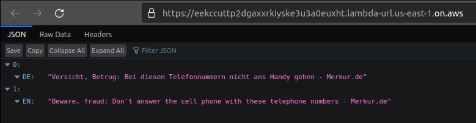

# Realtime News Translator Application - Python3

### English
> Note: A similar Node.js application can be found [here](https://github.com/kusumsiri/Realtime_News_Translator_Nodejs)

A real-time news translator application with Amazon serverless technology using Terraform and Python3. This app translates German news into English in real time. This conversion happens automatically when the Lambda function URL is accessed.

It uses two APIs. The [newsapi.org](https://newsapi.org/) API is used to pull news and then uses [Amazon Translate](https://docs.aws.amazon.com/translate/latest/dg/what-is.html), powered by advanced machine learning, to translate it.

The newsapi.org API-KEY is considered a secret value. So it must be set in a .tfvars file that is not in this repository. The key will then be set as an environment variable for the lambda function.

---
### Deutsch
> Note: Eine ähnliche Node.js-Anwendung finden Sie [hier](https://github.com/kusumsiri/Realtime_News_Translator_Nodejs)

Eine Echtzeit-Nachrichtenübersetzeranwendung mit serverloser Amazon-Technologie unter Verwendung von Terraform und Python3. Diese App übersetzt deutsche Nachrichten in Echtzeit ins Englische. Diese Konvertierung erfolgt automatisch, wenn auf die Lambda-Funktions-URL zugegriffen wird.

Es verwendet zwei APIs. Die [newsapi.org](https://newsapi.org/) API wird zum Abrufen von Nachrichten verwendet und verwendet dann [Amazon Translate](https://docs.aws.amazon.com/translate/latest/dg/what-is.html), unterstützt durch fortschrittliches maschinelles Lernen, um es zu übersetzen.

---
### The Output
### Die Ausgabe

